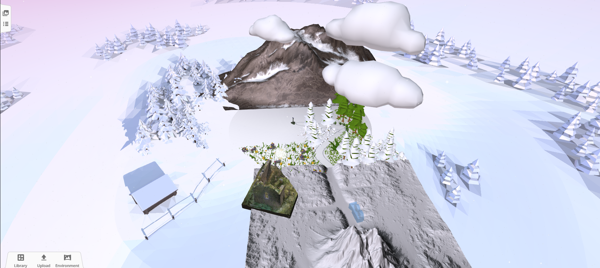
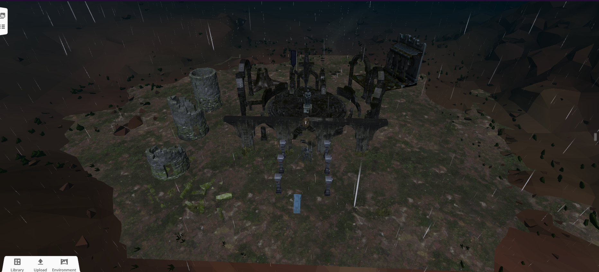
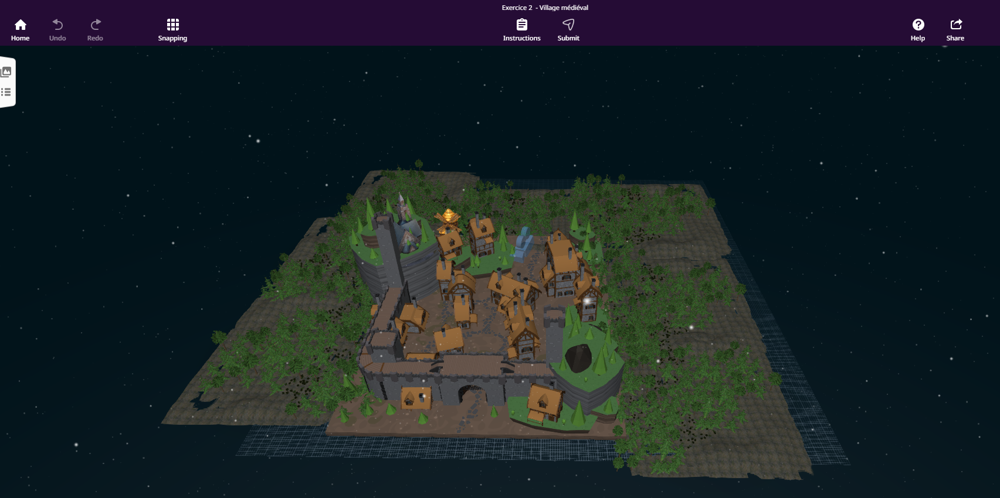

# 🌌 VR Dream Experience

> Problématique : Comment faire rêver les utilisateurs grâce à la réalité virtuelle ?

## 🎯 Présentation du projet

Ce projet explore comment la réalité virtuelle peut susciter l’émerveillement, l’évasion et l’émotion chez l’utilisateur à travers une expérience immersive.

En équipe de 6, nous avons conçu et réalisé 3 scènes sur **Delightex**, inspirées d’univers cinématographiques et fantastiques (ex : ambiances épiques à la manière du _Seigneur des Anneaux_, etc.).  
L’objectif est de plonger l’utilisateur dans des environnements marquants, capables de déclencher une sensation de “wow”.

---

## 🧠 Notre approche (faire rêver en VR)

Pour répondre à la problématique, nous avons travaillé sur :

- **Immersion visuelle** : décors, profondeur, échelle, cohérence des éléments
- **Ambiance** : lumières, atmosphère, effets (brouillard, contrastes, couleurs)
- **Sensation d’évasion** : lieux extraordinaires, paysages grandioses, univers inattendus
- **Expérience utilisateur** : lisibilité, rythme, découverte progressive
- **Cohérence artistique** : une identité claire par scène

---

## 🏗️ Outils & environnement

- Plateforme : **Delightex (CoSpaces Edu)**
- Création et mise en scène 3D
- Storyboard de conception
- Documentation & versioning : **GitHub**

---

## 🌄 Les 3 scènes immersives

### 1️⃣ Paysage montagneux enneigé

Un environnement naturel composé d’une montagne centrale entourée de forêts enneigées et d’éléments paysagers contrastés.

Objectif :

- Créer un sentiment de grandeur et d’espace
- Donner une impression de calme et d’immensité
- Plonger l’utilisateur dans un décor naturel spectaculaire

Ce décor joue sur la profondeur visuelle et la pureté du paysage pour provoquer l’émerveillement.

---

### 2️⃣ Ruines fantastiques sous la tempête

Une scène sombre inspirée d’univers épiques et fantastiques, avec des structures en ruines, une ambiance nocturne et des effets de pluie.

Objectif :

- Intensifier l’immersion par une atmosphère dramatique
- Créer une tension visuelle forte
- Donner la sensation d’explorer un monde mystérieux

L’environnement repose sur les contrastes, les effets météorologiques et la mise en scène centrale pour capter l’attention.

---

### 3️⃣ Village médiéval fortifié

Un village entouré de murailles, composé de maisons médiévales et intégré dans un environnement naturel nocturne.

Objectif :

- Proposer une immersion dans un univers historique
- Donner une sensation d’exploration et de découverte
- Créer un cadre cohérent et vivant

La disposition des bâtiments et des fortifications renforce la crédibilité de l’environnement et l’immersion globale.

---

## 🖼️ Aperçus

  
  

---

## 📖 Storyboard

Le storyboard est disponible dans le dossier `/docs`.  
Il présente la logique de conception, la progression de l’expérience et les intentions visuelles.

---

## 👥 Travail d’équipe (groupe de 6)

Le projet a été réalisé en équipe avec :

- Répartition des tâches (scènes, assets, ajustements, documentation)
- Points d’avancement réguliers
- Harmonisation finale pour assurer la cohérence globale
- Centralisation et structuration du repository GitHub

Compétences mises en avant :

- collaboration
- organisation
- communication
- intégration du travail de plusieurs personnes

---

## 📊 Compétences mobilisées

- Conception d’expérience immersive (VR)
- Direction artistique / mise en scène 3D
- Travail collaboratif
- Structuration et documentation d’un projet (GitHub)

---

## 🚀 Améliorations possibles

- Ajouter plus d’interactions utilisateur
- Intégrer un sound design plus poussé
- Optimiser les performances et la fluidité
- Enrichir les scènes (détails, effets, transitions)

---

## 📌 Contexte

Projet académique VR – 2026  
Plateforme : Delightex

https://edu.delightex.com/ELG-DGN

## Membres du groupe :

- REDJEMI Adel
- DJIONGO DONTSI Dany
- DI RENZO Julie
- MALBLANC Joaquim
- RABIAN Nicolas
- FRERE Adam
